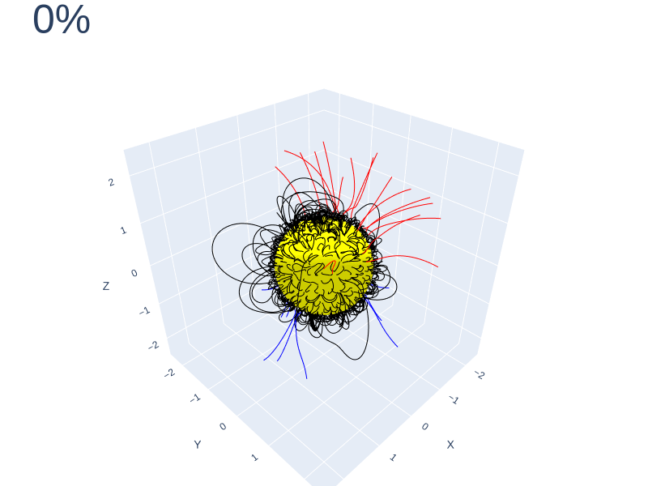

# Coronal Diffusion Model

This repository holds code to train and sample a generative diffusion model of the Solar Corona Magnetic Field. The code is trained using ADAPT-WSA simulation potential field solutions from the [SuryaBench](https://huggingface.co/datasets/nasa-ibm-ai4science/surya-bench-coronal-extrapolation) dataset.

## Publications

A publication is currently under review as a workshop paper at the [NeurIPS Machine Learning and the Physical Sciences Workshop](https://ml4physicalsciences.github.io/).

## Running the Code

Code is included to train the model, as well as running the model to generate samples. Examples of sampling the model can be fonud in the `notebooks/` directory. To train the model, the `train.py` script is run with no arguments, with configuration found in `config.py`.

## Contact

For questions and comments, the author can be contacted at [mail@danieldasilva.org](mailto:mail@danieldasilva.org), [daniel.e.dasilva@nasa.gov](mailto:daniel.e.dasilva@nasa.gov), or [ddasilva@umbc.edu](mailto:ddasilva@umbc.edu).
