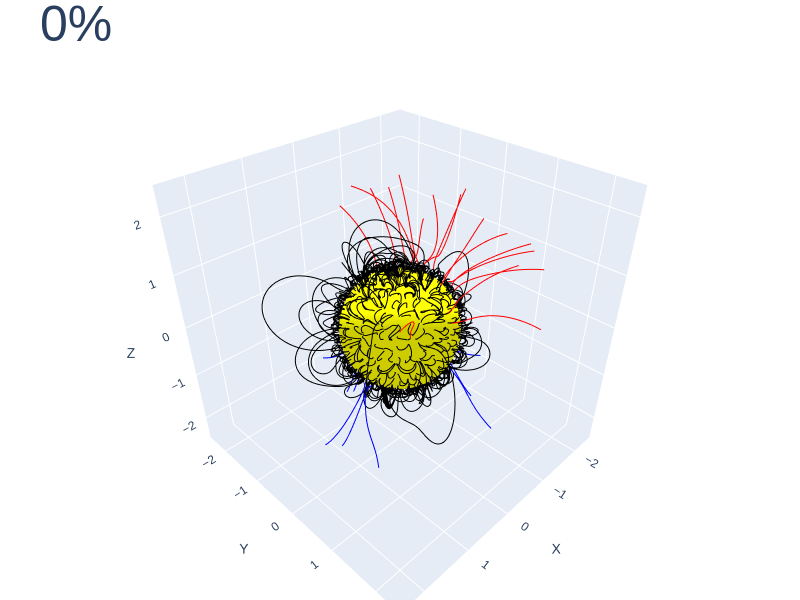

# Coronal Diffusion Model

This repository holds code to train and sample a generative diffusion model of theg Solar Corona Magnetic Field. It is currently under review for the Journal of Geophysical Research: Machine Learning & Computation.


## Pretrained weights

Pretrained weights are available on hugging face at [https://huggingface.co/ddasilva/coronal-diffusion-modeling](https://huggingface.co/ddasilva/coronal-diffusion-modeling).

## Running the Code

Code is included to train the model, as well as running the model to generate samples. Examples of sampling the model can be fonud in the `notebooks/` directory. To train the model, the `train.py` script is run with no arguments, with configuration found in `config.py`.

The full training process is:

```
$ python prepare_dataset.py
$ python write_scalers.
$ python write_spharm_fit_matrix.py
$ python train.py
```

Examples of generating samples and reproducing figures in the paper can be found in the `notebooks/` folder.